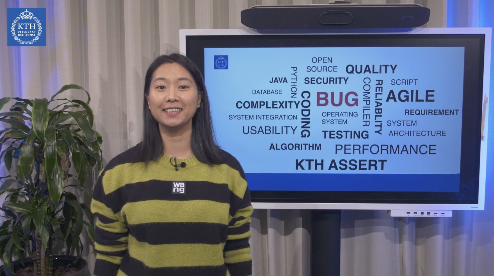

# He Ye

I received my Ph.D. degree in February 2023 at [KTH](https://www.kth.se/en) where I was fortunate to be advised by Prof. [Martin Monperrus](https://www.kth.se/profile/monp). My research interests include software testing, analysis, and trustworthy software construction. Particularly, my research focuses on automatic program repair and deep learning techniques for source code usage.

My research so far has included topics like automated patch generation and automated patch correctness assessment to identify overfitting patches generated by automatic repair systems.

## Publications
- **He Ye**, Matias Martinez, Xiapu Luo, Tao Zhang, and Martin Monperrus. SelfAPR: Self-supervised Program Repair with Test Execution Diagnostics. In Proceedings of the 37th IEEE/ACM International Conference on Automated Software Engineering (ASE ’22), October 10–14, 2022, Rochester, MI, USA. ACM, New York, NY, USA,  Article 92, 1–13. [[PDF]](https://arxiv.org/pdf/2203.12755.pdf) [[Code]](https://github.com/ASSERT-KTH/SelfAPR)
- **He Ye**, Matias Martinez, and Martin Monperrus. Neural program repair with execution-based backpropagation. In Proceedings of the 44th International Conference on Software Engineering (ICSE '22). Association for Computing Machinery, New York, NY, USA, 1506–1518. [[PDF]](https://dl.acm.org/doi/abs/10.1145/3510003.3510222) [[Code]](https://anonymous.4open.science/r/RewardRepair/README.md)

## Teaching Assistant
**2020.09 - 2021.06**
- DD2482 Automated Software Testing and DevOps
- DD2480 Software Engineering Fundamentals
- DA2210 Introduction to the Philosophy of Science and Research Methodology for Computer Scientists

**2019.09 - 2020.06**
- DD2482 Automated Software Testing and DevOps
- DD1334 Database Technology
- DD1393 Software Engineering
- DD2480 Software Engineering Fundamentals
- DA2210 Introduction to the Philosophy of Science and Research Methodology for Computer Scientists

**2018.01 - 2019.06**
- DD1393 Software Engineering
- DD2480 Software Engineering Fundamentals
- DA2210 Introduction to the Philosophy of Science and Research Methodology for Computer Scientists

## Contact
- email: hey@cs.cmu.edu
- email: heye@kth.se

## Experiences
- Jul 2023 - Present: Postdoctoral fellow at CMU
- Jan 2018 - Jun 2023: Ph.D. student at KTH
