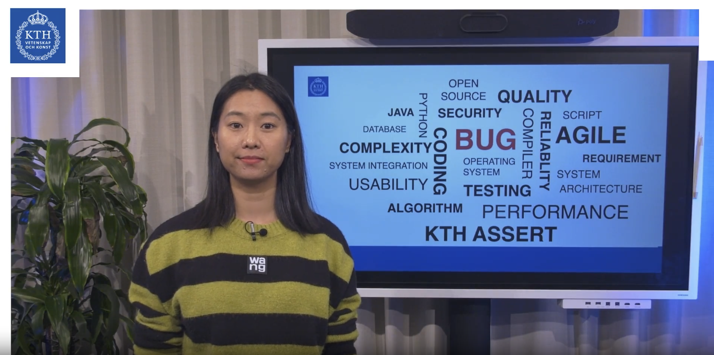
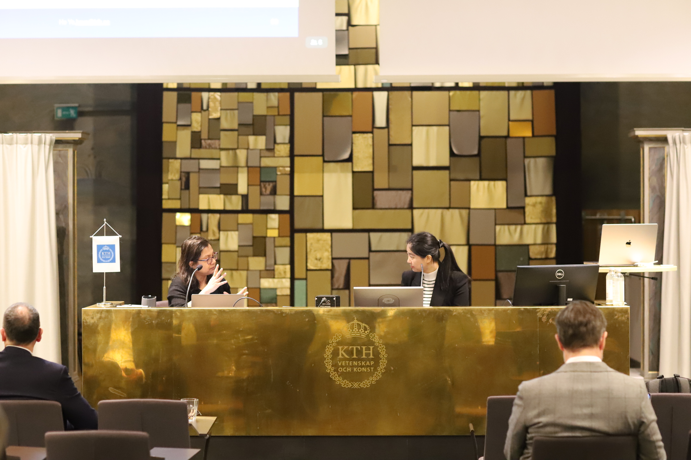
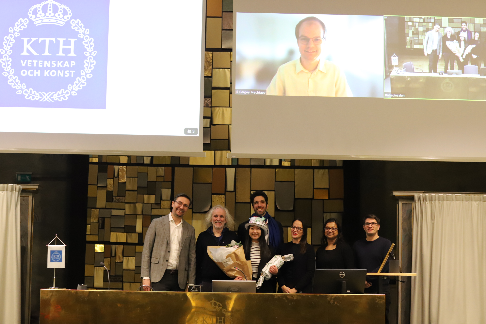

This is Ye! I am currently a postdoctoral researcher at the Software and Societal Systems Department (S3D) of Carnegie Mellon University, advised by Prof. [Claire Le Goues](https://clairelegoues.com). We are exploring research topics including but not limited to **AI-Assisted program repair and test generation**, **smart contract vulnerabilities** [(FSE'23)](https://dl.acm.org/doi/10.1145/3611643.3616343), and **debugging in WebAssembly**.

Prior to that, I completed my B.S. degree at Sichuan University and my Ph.D. degree at KTH Royal Institute of Technology where I was fortunate to be advised by Prof. [Martin Monperrus](https://www.kth.se/profile/monp), Prof. [Benoit Baudry](https://diro.umontreal.ca/english/department-directory/professors/professor/in/in36891/sg/Benoit%20Baudry/), and co-supervised by Prof. [Matias Martinez](https://www.martinezmatias.com/). During my PhD, my research focuses on **automated program repair** [(ICSE'22](https://dl.acm.org/doi/abs/10.1145/3510003.3510222),[ASE'22)](https://dl.acm.org/doi/abs/10.1145/3551349.3556926) , **fault localization** [(ICSE'24)](https://arxiv.org/pdf/2304.12015.pdf), **patch correctness assessment** [(TSE'22](https://ieeexplore.ieee.org/document/9399306),[EMSE'21)](https://link.springer.com/article/10.1007/s10664-020-09920-w), and **automated test generation** [(EMSE'21](https://link.springer.com/article/10.1007/s10664-020-09920-w),[JSS'21)](https://www.sciencedirect.com/science/article/abs/pii/S0164121220302193). 

I was fortunate to visit The Hong Kong Polytechnic University (PolyU) from October 2021 to April 2022. It was a fruitful experience to be advised by Prof. [Daniel Xiapu Luo](https://www4.comp.polyu.edu.hk/~csxluo/).

Outside of work, I enjoy sports (cycling/hiking/badminton), carpentry, playing pool, and playing the harmonica.

## News
- 🎉 03/2024, we received a GPU grant Berzelius-2024-131 from The National Academic Infrastructure for Supercomputing in Sweden (NAISS).
- 🎉 01/2024, my PhD dissertation received The Best Thesis of The Year Award (one recipient per year among five Swedish Universities affiliated with WASP)!
- 🎉 11/2023, I was invited to serve on the Program Committee of ASE 2024. Please consider submitting your paper!
- 🎉 11/2023, I was invited to attend Dagstuhl Seminar on "Automated Programming and Program Repair", excited to see you at Schloss Dagstuhl in October 2024!
- 🎉 10/2023, I was invited to serve on the Program Committee of ICSE 2025. Please consider submitting your paper!
- 🎉 09/2023, our work PreciseBugCollector received IEEE Distinguished Paper Award in ASE Industry Challenge Competition!
- 🎉 09/2023, I was invited to serve on the Program Committee of MSR 2024. Please consider submitting your paper!
- 🎉 08/2023, our work ITER was accepted to the ICSE 2024 research track!

## Publications
**Please check my full publication list in [Google Scholar](https://scholar.google.se/citations?user=K6V2VzsAAAAJ&hl=en)**.
-  [Preprint]  Aidan Z.H. Yang, Haoye Tian, **He Ye**, Ruben Martins, Claire Le GouesSecurity Vulnerability Detection with Multitask Self-Instructed Fine-Tuning of Large Language Models [[Paper]](https://arxiv.org/pdf/2406.05892)
-  [ICSE 2024]   **He Ye**, and Martin Monperrus. **ITER: Iterative Neural Repair for Multi-Location Patches**. Accepted to the 46th International Conference on Software Engineering, 2024.[[Paper]](https://arxiv.org/pdf/2304.12015.pdf) [[Data]](https://www.iterativerepair.tech/)
- [AAAI 2024] Wanjun Zhong, Lianghong Guo, Qiqi Gao, **He Ye**, Yanlin Wang. **MemoryBank: Enhancing Large Language Models with Long-Term Memory**. Proceedings of the 38th AAAI Conference on Artificial Intelligence, 2024. [[Paper]](https://arxiv.org/pdf/2305.10250.pdf)[[Code]](https://github.com/zhongwanjun/MemoryBank-SiliconFriend)
-  [ASE 2023 Industry Challenge]  **He Ye**, Zimin Chen, Claire Le Goues. **PreciseBugCollector: Extensible, Executable and Precise Bug-fix Collection**. Accepted to the 38th IEEE/ACM International Conference on Automated Software Engineering (ASE) Industry Challenge Competition, 2023. [[Paper]](https://arxiv.org/pdf/2309.06229.pdf) [[Code]](https://github.com/SophieHYe/PreciseBugs.git)   Distinguished Paper Award 🏆
-  [FSE 2023] Kunsong Zhao, Zihao Li, Jianfeng Li,  **He Ye**, Xiapu Luo, Ting Chen. **DeepInfer: Deep Type Inference from Smart Contract Bytecode.** Proceedings of the 31st ACM Joint European Software Engineering Conference and Symposium on the Foundations of Software Engineering (ESEC/FSE), 2023. [[Paper]](https://dl.acm.org/doi/10.1145/3611643.3616343)[[Code]](https://github.com/sepine/DeepInfer)
-  [ASE 2022]   **He Ye**, Matias Martinez, Xiapu Luo, Tao Zhang, and Martin Monperrus. **SelfAPR: Self-supervised Program Repair with Test Execution Diagnostics**. In Proceedings of the 37th IEEE/ACM International Conference on Automated Software Engineering. Article 92, pages 1–13, 2022. [[Paper]](https://dl.acm.org/doi/abs/10.1145/3551349.3556926) [[Code]](https://github.com/ASSERT-KTH/SelfAPR)
-  [ICSE 2022]  **He Ye**, Matias Martinez, and Martin Monperrus. **Neural Program Repair with Execution-based Backpropagation**. In Proceedings of the 44th International Conference on Software Engineering, pages 1506–1518, 2022. [[Paper]](https://dl.acm.org/doi/abs/10.1145/3510003.3510222) [[Code]](https://github.com/ASSERT-KTH/RewardRepair)
-  [TSE 2022, FSE 2022 Journal-first]  **He Ye**, Jian Gu, Matias Martinez, Thomas Durieux and Martin Monperrus.  **Automated Classification of Overfitting Patches With Statically Extracted Code Features**. In IEEE Transactions on Software Engineering, vol. 48, no. 8, pages 2920-2938. 2022. [[Paper]](https://ieeexplore.ieee.org/document/9399306)[[Code]](https://github.com/ASSERT-KTH/ODSExperiment)
-  [EMSE 2021, FSE 2021 Journal-first] **He Ye**, Matias Martinez, and Martin Monperrus. **Automated Patch Assessment for Program Repair at Scale**. Empirical Software Engineering, Volume 26, No. 2, 38 pages, 2021. [[Paper]](https://link.springer.com/article/10.1007/s10664-020-09920-w)    [[Code]](https://github.com/KTH/drr)
-  [JSS 2021, SANER IBF 2019]  **He Ye**, Matias Martinez, Thomas Durieux, Martin Monperrus. **A Comprehensive Study of Automatic Program Repair on the QuixBugs Benchmark**. Journal of Systems and Software (JSS), Volume 171, 2021. [[Paper]](https://www.sciencedirect.com/science/article/abs/pii/S0164121220302193)   [[Code]](https://github.com/ASSERT-KTH/quixbugs-experiment)  Best Paper Award 🏆
- [IEEE Software 2021] Benoit Baudry, Zimin Chen, Khashayar Etemadi, Han Fu, Davide Ginelli, Steve Kommrusch, Matias Martinez, Martin Monperrus, Javier Ron, **He Ye**, Zhongxing Yu (Equal Contribution, Sorted by Alphabetical Order). **A software-repair robot based on continual learning**. IEEE Software, Volume 4, pages 28-35, 2021.

## Contact
- Email: hey[AT]cs[DOT]cmu[DOT]edu
- Twitter: @ye_he_ye

              
## Talks
Please check out my general research interest in the following video:

## Grants
- WASP International Academic Visit Grant 2021-2022, 100,000 SEK (**Solo PI**).
- KAW Postdoc Fellowship at CMU 2023-2025, 150,000 USD (**PI**, with Prof. Claire Le Goues).
- 2023 NAISS GPU Grant Berzelius-2023-175 - NVIDIA SuperPOD consisting of 94 DGX-A100 nodes (**PI**).
- 2024 NAISS GPU Grant Berzelius-2024-131 - NVIDIA SuperPOD consisting of 94 DGX-A100 nodes (**PI**).
- SIGSOFT CAPS travel grant to attend ICSE 2024 Conference (800 USD).

## Awards and Honors
- 3rd place at ICSE 2024 Automated Program Repair Competition in the Java bug AI track.
-  Best Thesis of The Year Award in 2023  (one recipient per year among 5 Swedish Universities affiliated with WASP).
-  Distinguished Paper Award  by IEEE ASE 2023 Industry Challenge Competition, earning a prize of 7,000 EURO.
-  Best Paper Award  by IEEE SANER International Bug Fixing (IBF) in 2019.

## Services
#### Program Committee: 
- ICSE Research Track (2025); ASE Research Track (2024)
- MSR Technical Track (2024); SANER Demo Track (2023)
- ICSE-APR Workshop (2022, 2023, 2024)

#### Journal Reviewer:
- TSE (2022,2023,2024); TOSEM (2023,2024); TDSC (2022,2023,2024); EMSE(2024)
- Elsevier SCP (2023); Elsevier IST (2023); ASE Journal (2024)

#### Organizing Committee: 
- Proceedings Co-chair of [Internetware 2024](https://conf.researchr.org/home/internetware-2024).
- Publicity Co-chair of [APSEC 2024](https://conf.researchr.org/home/apsec-2024).
  
## Teaching Assistant 
(Every year during my PhD, I spent 20% of my time on teaching duties, and I am grateful for the valuable teaching experience I gained)
*  DD1393 Software Engineering (undergraduate industrial SE project course): 2018,2019,2020
*  DD1334 Database Technology (undergraduate): 2019
*  DD2482 Automated Software Testing and DevOps (masters): 2019,2020,2021
*  DD2480 Software Engineering Fundamentals (masters): 2018,2019,2020
*  DA2210 Introduction to the Philosophy of Science and Research Methodology for Computer Scientists (masters): 2018, 2019, 2020

## PhD Supervision with My Supervisors
* **Four PhD students at CMU:** Kush Jain, Cláudia Mamede, Luke Dramko, Aidan Yang
* **One PhD student at KTH:** André Silva
* **One Master student at MUST:** Chang Hu

## Master Thesis Supervision at KTH
- Johan Luttu. Hidden Costs and Opportunities of Kotlin versus Java on Android Runtime (Master's thesis collaboration with Spotify). The thesis is available [here](https://www.diva-portal.org/smash/get/diva2:1428211/FULLTEXT01.pdf), 2020. 
- Abgeiba Yaroslava Isunza Navarro. Evaluation of Attention Mechanisms for Just-In-Time Software Defect Prediction (Master's thesis collaboration with Ericsson). The thesis is available [here](https://kth.diva-portal.org/smash/get/diva2:1516229/FULLTEXT01.pdf), 2020.
- Ziyi Xiang. Java Syntax Error Repair Using RoBERTa. The thesis is available [here](https://www.diva-portal.org/smash/get/diva2:1656591/FULLTEXT01.pdf), 2022.
- Andreas Jönsson. Improving Pre-training Neural Model on Code. 2023.

## PhD Defense
I will always be grateful to my supervisors: Martin, Benoit and Matias, and to my jury committee: 
- Prof. Baishakhi Ray (Columbia University), 
- Prof. Nicole Novielli (University of Bari),
- Prof. Robert Feldt (Chalmers University of Technology in Gothenburg),
- Prof. Sergey Mechtaev (University College London).
  
Thank you all for making it happen!

